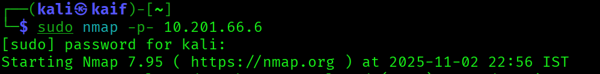
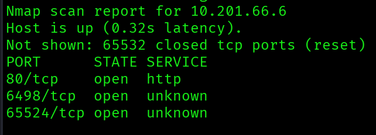
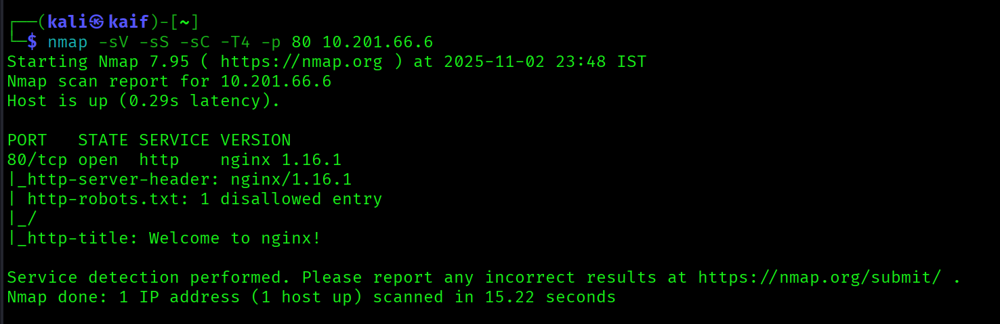
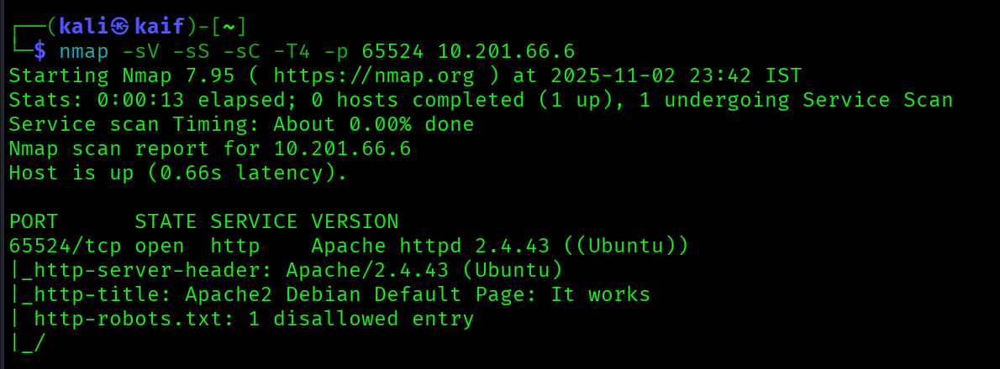
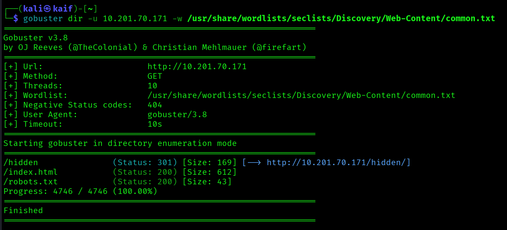
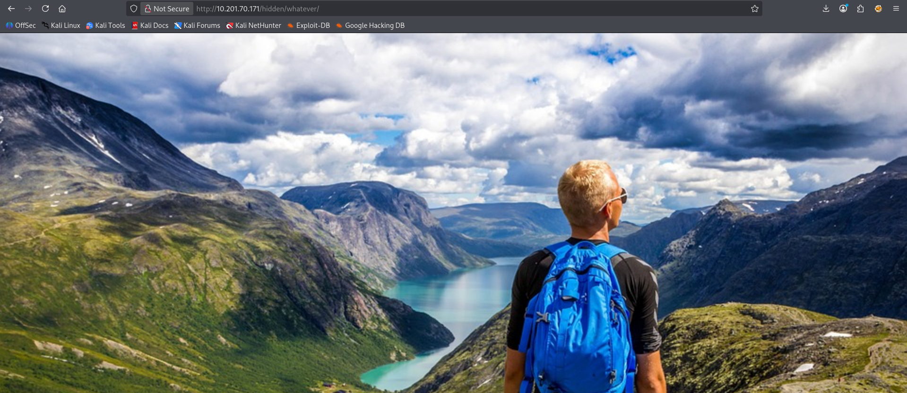
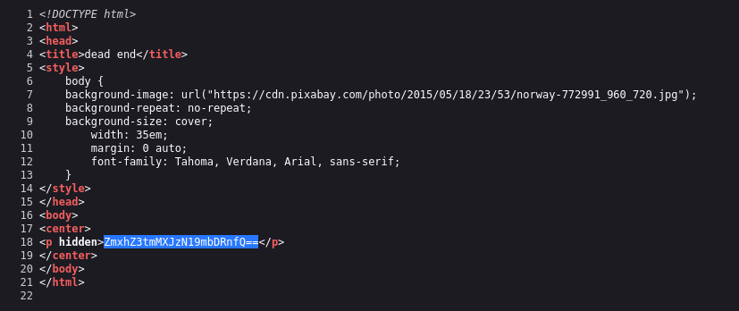
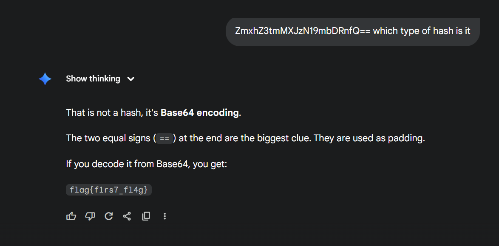

# TryHackMe Writeup - Easy Peasy

- TryHackMe Room : <https://tryhackme.com/room/easypeasyctf>


Write-up and walkthrough of the TryHackMe ‘Easy Peasy’ room, including step-by-step process with screenshots.

# Tools Used
- `Nmap`
- `gobuster`

# Task1

## 1. How many ports are open?

To find this, first we have to run a command - `sudo nmap -sV -p- TARGET` 





As you can see, I found the 3 open ports


```commandline
3
```

## 2. What is the version of nginx?

you have to check on port 80


```commandline
1.16.1
```

## 3. What is running on the highest port?

now lets check on port 65524 you can find awsers of 1 to 3 by running only one command and that is -`sudo nmap -sV -p- TARGET` so you dont have to use diffrent commands to find diffrent awsers here but i use diffrent commands for every singel qustions


now we can see Apache so thats the awnser

```commandline
Apache
```

# Task2

## 4. Using GoBuster, find flag 1.



now there is one more hidden directory and that is -`/whatever`  so simply visit there



after that we have check a page source



and we can find this so to know what it is i simply ask to gemini 



```commandline
flag{f1rs7_fl4g}
```

## 5. 


```commandline

```

## 6. 


```commandline

```

## 7. 


```commandline

```

## 8. 


```commandline

```

## 9. 


```commandline

```

## 10. 


```commandline

```

## 11. 


```commandline

```

## Conclusion


