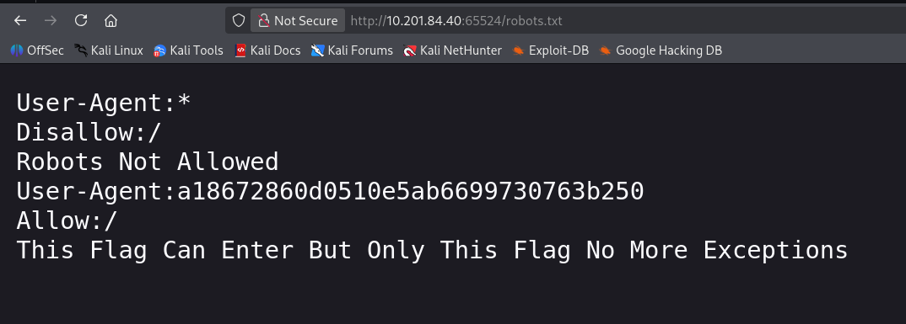
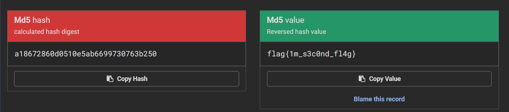
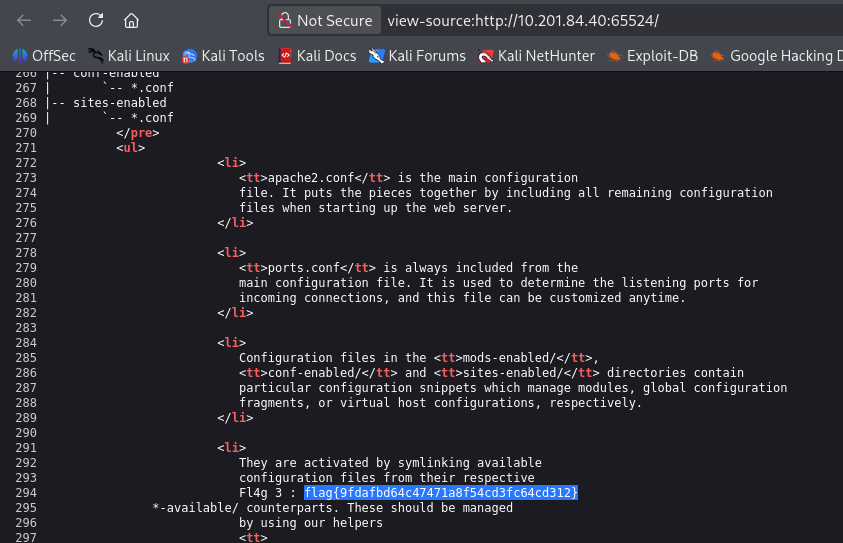
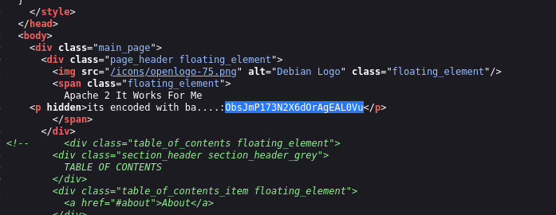
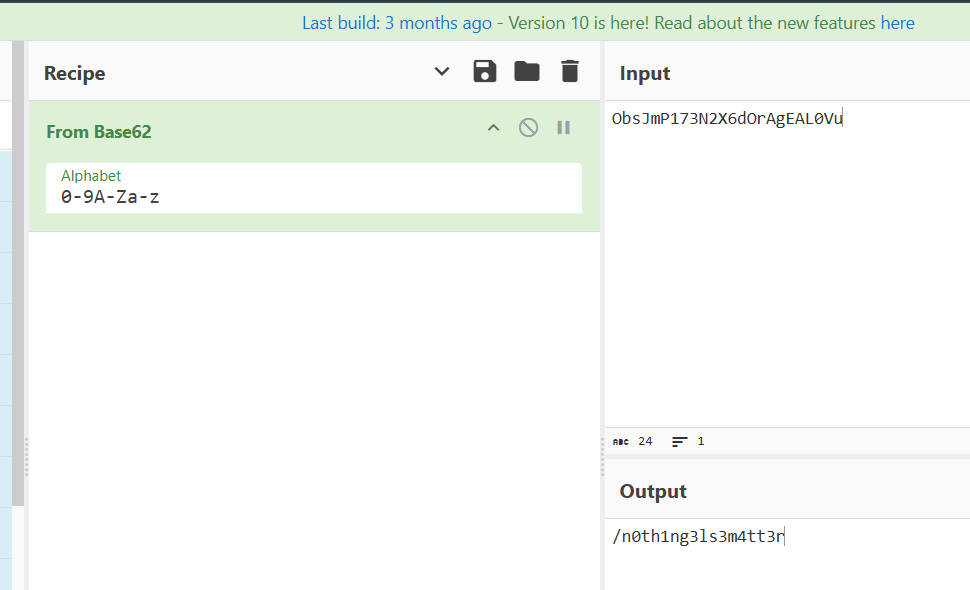
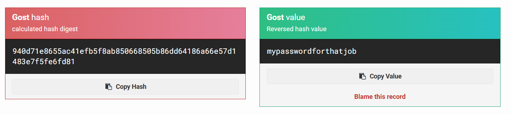

# TryHackMe Writeup - Easy Peasy

- TryHackMe Room : <https://tryhackme.com/room/easypeasyctf>


Write-up and walkthrough of the TryHackMe ‘Easy Peasy’ room, including step-by-step process with screenshots.

# Tools Used
- `Nmap`
- `gobuster`

# Task1

## 1. How many ports are open?

To find this, first we have to run a command - `sudo nmap -sV -p- TARGET` 


As you can see, I found the 3 open ports


```commandline
3
```

## 2. What is the version of nginx?

you have to check on port 80


```commandline
1.16.1
```

## 3. What is running on the highest port?

now lets check on port 65524 you can find awsers of 1 to 3 by running only one command and that is -`sudo nmap -sV -p- TARGET` so you dont have to use diffrent commands to find diffrent awsers here but i use diffrent commands for every singel qustions


now we can see Apache so thats the awnser

```commandline
Apache
```

# Task2

## 4. Using GoBuster, find flag 1.


now there is one more hidden directory and that is -`/whatever`  so simply visit there


after that we have to check a page source


and we can find this so to know what it is i simply ask to gemini 


```commandline
flag{f1rs7_fl4g}
```

## 5. Further enumerate the machine, what is flag 2?

so in privuse qustion we performed -`gobuster` and we found hiden directory -`/roborts.txt` so simply visit there and you can find this



no to decode it i use -`md5hashing.net`



```commandline
flag{1m_s3c0nd_fl4g}
```

## 6. Crack the hash with easypeasy.txt, What is the flag 3?

so this time we can find direcot awnser on -`TARGETIP:65524/` so visit there and find carefully you can find awnser



```commandline
flag{9fdafbd64c47471a8f54cd3fc64cd312}
```

## 7. What is the hidden directory?

while finding a awnser of qustion 6 you also seen this 



to decode it you have to use format base62 on -`Cyberchef`



```commandline
/n0th1ng3ls3m4tt3r
```

## 8. Using the wordlist that provided to you in this task crack the hash what is the password?

 now to find it you have visit TARGWTIP/n0th1ng3ls3m4tt3r and in that page viwe page source then you can see a hash 
 then crack it on -`md5hashing.net`




```commandline
mypasswordforthatjob
```

## 9. 


```commandline

```

## 10. 


```commandline

```

## 11. 


```commandline

```

## Conclusion


