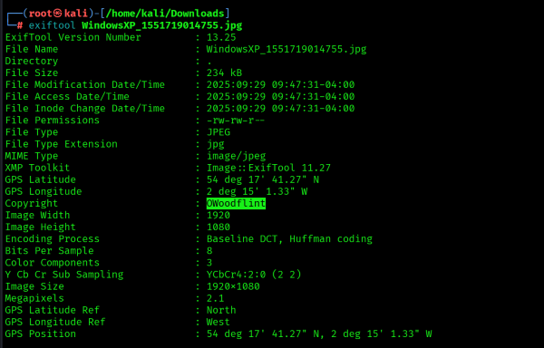
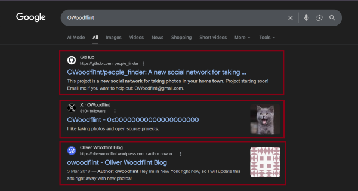
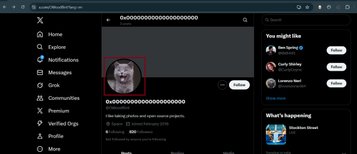
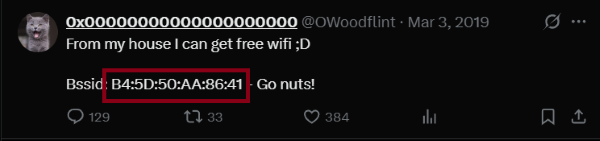
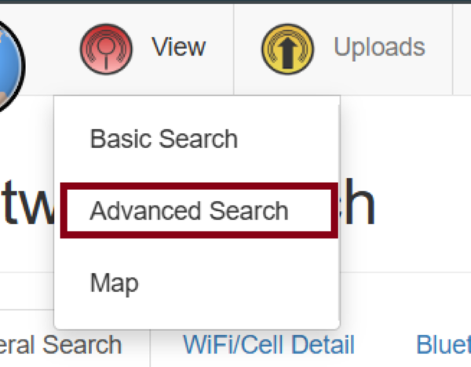
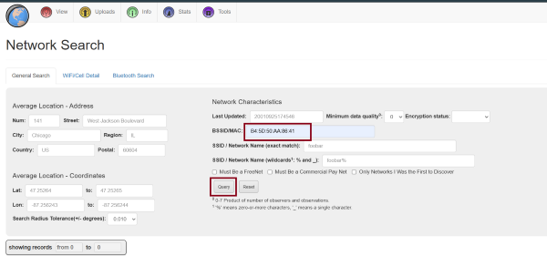
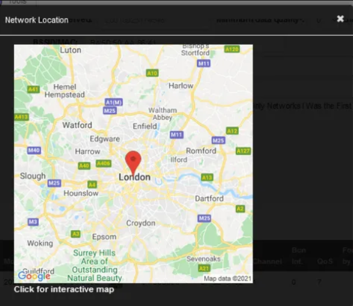
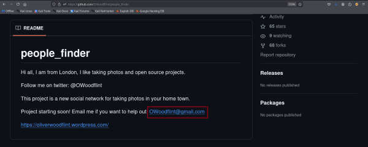
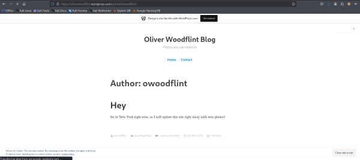
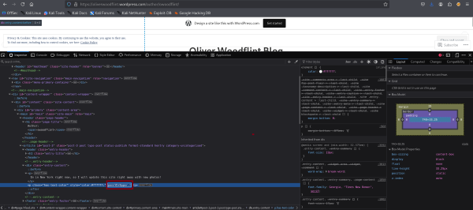

# TryHackMe Writeup - OhSINT

- TryHackMe Room : <https://tryhackme.com/room/ohsint>


Write-up and walkthrough of the TryHackMe ‘OhSINT’ room, including step-by-step process with screenshots.

# Tools Used
- `exiftool`

## 1. What is this user's avatar of?

To find this, first we have to gather some information about the image (download the image first). For that, I used - `exiftool` 



As you can see, I found the photographer's username - `owoodflint`
Now I searched for it on the Internet. 



As you can see, I found:
- `Github`
- `tweeter`
- `wordpress blog`

To find the user's avatar, I visited the Twitter profile and found this:




```commandline
CAT
```

## 2. What city is this person in?

To find this info, we can also find the BSSID in the tweet.



Then I visited - `Wigle.net` (You have to register first)



Then enter that BSSid 



Then you can see this (sometimes the map is hidden on the page, so you have to find it).



```commandline
London
```

## 3. What is the SSID of the WAP he connected to?

On the same page where I found "London." 


```commandline
UnileverWiFi
```

## 4. What is his personal email address?

Now, to find the email I visited his - `Github` profile and find this 




```commandline
OWoodflint@gmail.com
```

## 5. What site did you find his email address on?


```commandline
Github
```

## 6. Where has he gone on holiday?

To find this, I visited his- `wordpress blog`



```commandline
New York
```

## 7. What is the person's password?

In the page source of the WordPress blog, you can find his password (you have to look carefully).



```commandline
pennYDr0pper.!
```

## Conclusion

Completing the OhSINT room demonstrates how powerful OSINT techniques can be when applied correctly. From metadata to social media, a simple photo can reveal usernames, locations, emails, and even passwords. This was a valuable reminder of the importance of privacy and security in our digital lives.

