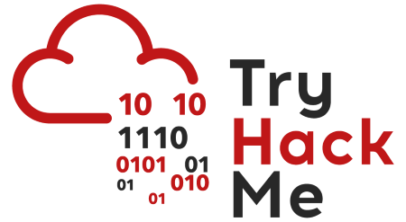

# TryHackMe-Writeups

This repository contains my TryHackMe CTF (Capture The Flag) writeups. Each writeup is organized by room, OS, description, and tools used.

Check out the TryHackMe website: <https://tryhackme.com>

Here's a link to my TryHackMe profile:

## TryHackMe Writeups Table

| Room Name | OS | Description | Tools Used |
|:---:|:---:|---|---|
| [Simple CTF](Simple-CTF/README.md) | Linux (Ubuntu) | Basic enumeration and exploitation. | `nmap`, `gobuster`, `searchsploit` |
| [OhSINT](OhSINT/README.md) | Linux (Ubuntu) | OSINT challenge from a single image. | `exiftool` |
| [Room 3 Name](room3/README.md) | Linux (CentOS) | Brief description of Room 3 | `nmap`, `wpscan`, `john` |

