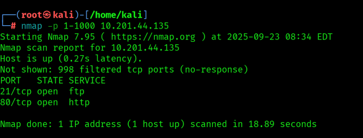

# Try Hack Me Writeup - Simple CTF

- Tryhackme Room : <https://tryhackme.com/room/easyctf>


Write-up and walkthrough of the TryHackMe ‘Simple CTF’ room, including step-by-step exploitation process with screenshots.

#Tools Used
- `nmap`
- `gobuster`
- `searchsploit`

# 1. How many services are running under port 1000?

To find ports below 1000 we can use - `nmap -p 1-1000 TARGET-IP`



We can see here is 2 ports are running under port 1000

```commandline
SSH
```

# 2. What is running on the higher port?

To find that we can perform simple nmap scans 
- `nmap TARGET-IP`
- `nmap -sV -p 1-2222 TARGET-IP`


We can see ssh are running 

```commandline
SSH
```

# 3. What's the CVE you're using against the application?

